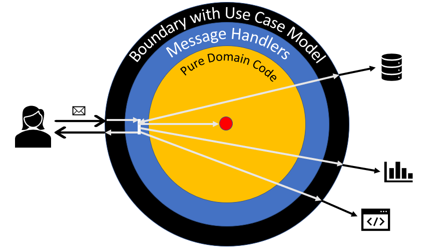

# requirements as code 
[](https://travis-ci.org/bertilmuth/requirementsascode)



Requirements as code does not replace conversations. It offers a formal way to record conversation results where it matters: in the code. Translate use cases into code to improve the long term maintenance of your application.

In use case theory, use cases look at the system from a user's perspective. Technology decisions are postponed to the use case realization. This separation enables more focused discussions about the value the system provides to users, and finding the right solution for the problem to solve.

In requirements as code, use case models are free of technical infrastructure as well. Models call message handlers through interfaces. Message handlers are the use case realization. They orchestrate the calls to the domain code and the infrastructure external to the boundary. This makes it easier for you to change your technical infrastructure later in development.

In use case theory, a use case specifies interactions between users and the system.

In requirements as code, an interaction is:
* a message class, and
* a message handler that defines how the system reacts when receiving an instance of the message class. 

The message handler calls the domain/infrastructure code and then:
* doesn't return anything,
* returns a query result, or 
* returns an event to be published.

You can also specify a precondition. 

If your interactions are independent from each other, that's your use case model. For sequences of interactions, create a [use case model with flows](https://github.com/bertilmuth/requirementsascode/tree/master/requirementsascodeexamples/helloworld) instead.
It's a simple alternative to state machines, understandable by developers and business people alike.

Requirements as code is influenced by the ideas of [clean architecture](https://blog.cleancoder.com/uncle-bob/2012/08/13/the-clean-architecture.html) and [hexagonal architecture](https://web.archive.org/web/20180822100852/http://alistair.cockburn.us/Hexagonal+architecture). It can be used to [implement them](https://dev.to/bertilmuth/implementing-a-hexagonal-architecture-1kgf). And it goes beyond them.

When you follow the design principles of requirements as code, you will end up with pure domain code. The domain code doesn't communicate with technical infrastructure, not even through interfaces. That's why you can test the domain code without mocking anything.

The use case model at the boundary represents the single source of truth for interactions started by the user. You can [generate living documentation](https://github.com/bertilmuth/requirementsascode/tree/master/requirementsascodeextract) from the use case model. The generated use case documents represent an always up to date information about how the system works from a user's perspective.

# getting started
Requirements as code is available on Maven Central.

The size of the core jar file is less than 64 kBytes. It has no further dependencies.

If you are using Maven, include the following in your POM, to use the core:

``` xml
  <dependency>
    <groupId>org.requirementsascode</groupId>
    <artifactId>requirementsascodecore</artifactId>
    <version>1.2.4</version>
  </dependency>
```

If you are using Gradle, include the following in your build.gradle, to use the core:

```
compile 'org.requirementsascode:requirementsascodecore:1.2.4'
```

At least Java 8 is required to use requirements as code, download and install it if necessary.

# how to build and run a use case model
Here's what you need to do as a developer.

## Step 1: Build a use case model
``` java
Model model = Model.builder()
	.user(<message class>).system(<message handler)>)
	.user(..).system(...)
	...
.build();
```

For handling commands, the message handler has a `Consumer<message class>` or `Runnable` type.
For handling queries or publishing events, the message handler has a `Function<message class, Object>` type.
For handling events, use `.on()` instead of `.user()`.
For handling exceptions, use the specific exception's class or `Throwable.class` as parameter of `.on()`.
Use `.condition()` before `.user()`/`.on()` to define an additional precondition that must be fulfilled.
You can also use `condition(...)` without `.user()`/`.on()`, meaning: execute at the beginning of the run, or after a step has been run,
if the condition is fulfilled.

## Step 2: Create a runner, and run the model
``` java
ModelRunner runner = new ModelRunner().run(model);
```

## Step 3: Send a message to the runner
``` java
Optional<Object> queryResultOrEvent = runner.reactTo(<Message POJO Object>);
```
To customize the behavior when the runner reacts to a message, use `modelRunner.handleWith()` (example [here](https://github.com/bertilmuth/requirementsascode/tree/master/requirementsascodeexamples/crosscuttingconcerns)).
By default, if a message's class is not declared in the model, the runner consumes it silently.
To customize that behavior, use `modelRunner.handleUnhandledWith()`.
If an unchecked exception is thrown in one of the handler methods and it is not handled by any 
other handler method, the runner will rethrow it.

# Example
Here's a complete example:

``` java
package hello;

import java.util.Optional;
import java.util.function.Consumer;
import java.util.function.Function;

import org.requirementsascode.Model;
import org.requirementsascode.ModelRunner;

public class Main {
  public static void main(String[] args) {
    Boundary boundary = new Boundary(new DisplayHello());
    new MessageSender(boundary).run();
  }
}

/**
 * Sender of the message, external to the boundary
 */
class MessageSender {
  private Function<Object, Optional<Object>> boundary;

  public MessageSender(Function<Object, Optional<Object>> boundary) {
    this.boundary = boundary;
  }

  public void run() {
    boundary.apply(new RequestHello("Joe"));
  }
}

/**
 * Command class
 */
class RequestHello {
  private String userName;

  public RequestHello(String userName) {
    this.userName = userName;
  }

  public String getUserName() {
    return userName;
  }
}

/**
 * Boundary class that sets up the use case model, and reacts to messages by
 * dispatching them to message handlers.
 */
class Boundary implements Function<Object, Optional<Object>> {
  private static final Class<RequestHello> requestsHello = RequestHello.class;
  private Model model;

  public Boundary(Consumer<RequestHello> displaysHello) {
    buildModel(displaysHello);
  }

  private void buildModel(Consumer<RequestHello> displaysHello) {
    model = Model.builder()
      .user(requestsHello).system(displaysHello)
     .build();
  }

  public Optional<Object> apply(Object message) {
    return new ModelRunner().run(model).reactTo(message);
  }
}

/**
 * Command handler
 */
class DisplayHello implements Consumer<RequestHello> {
  public void accept(RequestHello requestHello) {
    System.out.println("Hello, " + requestHello.getUserName() + ".");
  }
}
```

# publishing events
When you use the `system()` method, you are restricted to just consuming messages.
But you can also publish events with `systemPublish()`, like so:

``` java
private void buildModel() {
  Model model = Model.builder()
    .on(EnterName.class).systemPublish(this::publishNameAsString) 
    .on(String.class).system(this::displayNameString) 
   .build();			
}

private String publishNameAsString(EnterName enterName) {
  return enterName.getUserName();
}

public void displayNameString(String nameString) {
  System.out.println("Welcome, " + nameString + ".");
}
```

As you can see, `publishNameAsString()` takes a command object as input parameter, and returns an event to be published. In this case, a String.
By default, the model runner takes the returned event and publishes it to the model. 

This behavior can be overriden by specifying a custom event handler on the ModelRunner with `publishWith()`.
For example, you can use `modelRunner.publishWith(queue::put)` to publish events to an event queue.

# event queue for non-blocking handling (experimental)
The default mode for the ModelRunner is to handle messages in a blocking way. 
Instead, you can use a simple event queue that processes events one by one in its own thread:

``` java
Model model = ...;
ModelRunner modelRunner = new ModelRunner();
modelRunner.run(model);

EventQueue queue = new EventQueue(modelRunner::reactTo);
queue.put(new String("I'm an event, react to me!"));
```

The constructor argument of `EventQueue` specifies that each event that's `put()` will be placed in the queue, and then forwarded to `ModelRunner.reactTo()`.
Note that you can forward events to any other consumer of an object as well.
You have to call `queue.stop()` to terminate the event queue thread before exiting your application.

# documentation
* [Examples for building/running state based use case models](https://github.com/bertilmuth/requirementsascode/tree/master/requirementsascodeexamples/helloworld)
* [How to generate documentation from models](https://github.com/bertilmuth/requirementsascode/tree/master/requirementsascodeextract)
* [Cross-cutting concerns example](https://github.com/bertilmuth/requirementsascode/tree/master/requirementsascodeexamples/crosscuttingconcerns)

# publications
* [Implementing a hexagonal architecture](https://dev.to/bertilmuth/implementing-a-hexagonal-architecture-1kgf)
* [Kissing the state machine goodbye](https://dev.to/bertilmuth/kissing-the-state-machine-goodbye-34n9)
* [The truth is in the code](https://medium.freecodecamp.org/the-truth-is-in-the-code-86a712362c99)

# subprojects
* [requirements as code core](https://github.com/bertilmuth/requirementsascode/tree/master/requirementsascodecore): create and run models. 
* [requirements as code extract](https://github.com/bertilmuth/requirementsascode/tree/master/requirementsascodeextract): generate documentation from the models (or any other textual artifact).
* [requirements as code examples](https://github.com/bertilmuth/requirementsascode/tree/master/requirementsascodeexamples): example projects illustrating the use of requirements as code.

# build from sources
Use Java >=11 and the project's gradle wrapper to build from sources.

# related topics
* The work of Ivar Jacobson on Use Cases. As an example, have a look at [Use Case 2.0](https://www.ivarjacobson.com/publications/white-papers/use-case-ebook).
* The work of Alistair Cockburn on Use Cases, specifically the different goal levels. Look [here](http://alistair.cockburn.us/Use+case+fundamentals) to get started, or read the book "Writing Effective Use Cases".
